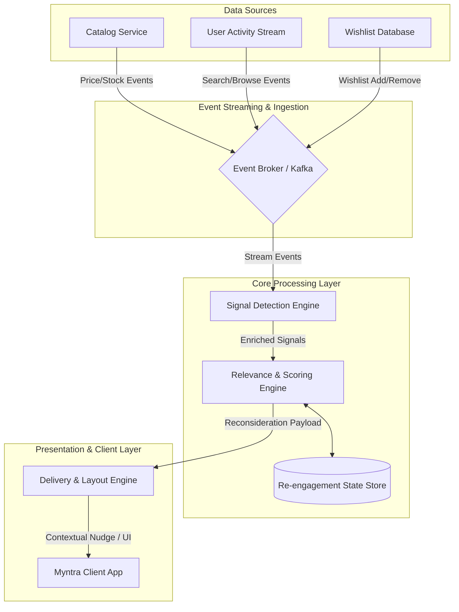

# Architectural Design: Wishlist Re-engagement Engine (Myntra Case Study)

This document outlines the high-level system architecture, component design, and data flows for the Wishlist Re-engagement Engine. The system is designed to transform passive bookmarks into active purchasing momentum by delivering timely, context-driven, non-intrusive nudges.

---

## 1. System Architecture Overview

The system utilizes an **Event-Driven Microservices Architecture** to capture real-time catalog changes and user activity, evaluate relevance, and trigger non-intrusive re-engagement touchpoints.



---

## 2. Component Design

### 2.1. Signal Detection Engine
Monitors multiple data streams to identify triggers associated with wishlisted items:
* **Price Monitor:** Listens to catalog updates for price drops on wishlisted items.
* **Inventory Monitor:** Monitors stock changes (e.g., "Back in Stock" or "Only 2 Left in your Size").
* **Interest Detector:** Tracks user search queries or category views matching categories/brands of wishlisted items.
* **Temporal Trigger:** A cron/timer system identifying items nearing their 30-day wishlist age.

### 2.2. Relevance & Scoring Engine
Prevents spam and prioritizes high-impact re-engagement opportunities:
* **Cooldown Controller:** Ensures a user is not nudged too frequently (e.g., maximum 1 nudge per session, limit weekly notifications).
* **Context Classifier (Groq API Powered):** Leverages the Groq API (using lightweight models like Llama-3-8b for sub-10ms inference) to semantically classify user search intent and match it to wishlist items instead of relying on fragile keyword matching.
* **Reconsideration Score:** A lightweight ranking formula:
  $$\text{Reconsideration Score} = f(\text{Signal Strength}, \text{Recency}, \text{Current Intent Match})$$

### 2.3. Delivery & Layout Engine
Prepares the non-intrusive UI widgets and delivers them dynamically to the Myntra client app.
* **Dynamic Copywriter (Groq API Powered):** Dynamically generates personalized, non-spammy reasonings/copy in real-time (e.g., "Size M in H&M Men Bomber Jacket is back in stock. Price remains at ₹1,999.") tailored to the user's current search context.
* **Sparkle Burst Handler:** Triggers a golden sparkle/burst particle animation next to the wishlist heart icon (notification anchor) lasting 0.8 seconds.
* **Floating Pill Capsule:** Renders a sleek, compact, non-intrusive floating pill capsule next to the heart icon that auto-dismisses after 5 seconds to prevent browsing disruption.

---

## 3. Data Schema & Contracts

### 3.1. Wishlist Signal Event (Kafka Payload)
```json
{
  "eventId": "uuid-v4-12345",
  "userId": "usr_987654",
  "productId": "prod_hm_jacket_123",
  "triggerType": "PRICE_DROP" | "LOW_STOCK" | "RENEWED_SEARCH" | "TEMPORAL_30D",
  "timestamp": "2026-08-30T12:00:00Z",
  "metadata": {
    "originalPrice": 3999,
    "currentPrice": 1999,
    "sizeRequested": "M",
    "stockCount": 5
  }
}
```

### 3.2. Delivery Payload (API Contract)
```json
{
  "userId": "usr_987654",
  "nudgeType": "SPARKLE_BURST_CAPSULE",
  "targetProductId": "prod_hm_jacket_123",
  "copywriterText": "Size M in H&M Men Bomber Jacket is back in stock. Price remains at ₹1,999.",
  "routingUrl": "myntra://product/prod_hm_jacket_123",
  "displayConfig": {
    "colorPalette": "golden_gradient",
    "animation": "sparkle_burst",
    "autoDismissSeconds": 5
  }
}
```

---

## 4. Key User Flow & Integration Points

1. **User Action:** The user searches for "casual jackets" on Myntra.
2. **Intent Capture:** The *User Activity Stream* publishes a search event.
3. **Signal Match:** The *Signal Detection Engine* checks if the user has a matching jacket in their wishlist.
4. **Scoring:** The *Relevance Engine* sees a match, validates the cooldown state, and calculates a high score.
5. **Nudge Generation:** The *Delivery Engine* triggers a golden **Sparkle Burst** animation around the wishlist header heart icon and displays the sleek **Floating Pill Capsule** next to it: *“💥 The size you wanted is back! Size M in H&M Men Bomber Jacket is back in stock.”*
6. **Interaction:** The user clicks the capsule (pill), which records click telemetry and effortlessly redirects them to the Product Details Page (PDP) to complete the purchase.

---

## 5. Non-Functional Requirements & Performance Goals

* **Latency:** Relevance check and nudge payload delivery must execute within **< 150ms** during client search requests.
* **Scalability:** Event broker must handle **10,000+ events per second** during peak sale periods (e.g., End of Reason Sale).
* **Privacy & Control:** Users must have clear controls in settings to disable/customize wishlist notifications.
